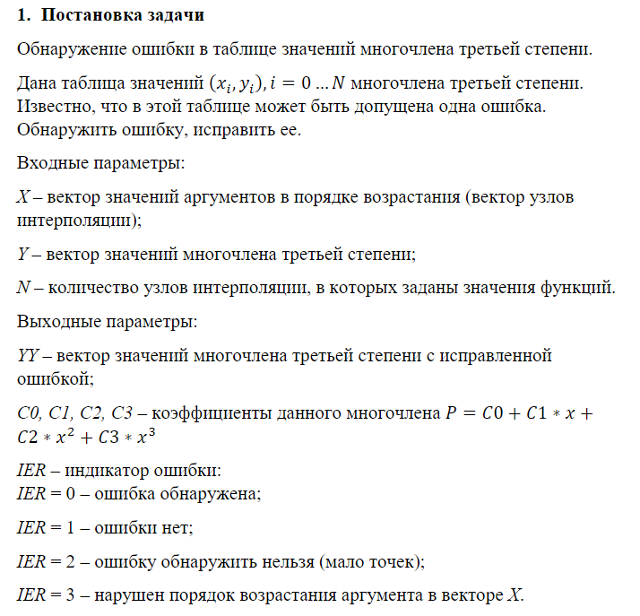
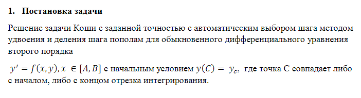
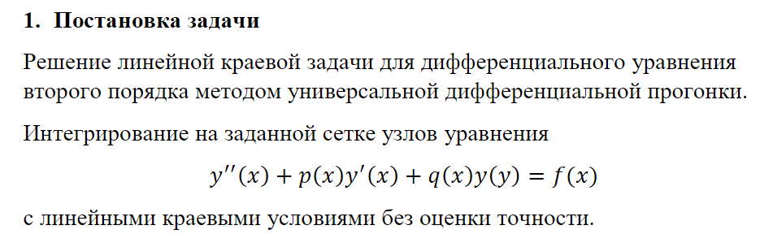

# Численные методы 6 семестр

В каждой лабе внутри отчет, в нем подробно описано задание

**./lab1 - Вариант 15**

Таск задание 1 Вариант 15

**./lab2 - Задание 10 вариант 3**

Таск задание 10 Вариант 3

**./lab3 - Тема 6 Задание 2 Вариант 10**

Таск задание 2 Вариант 10

