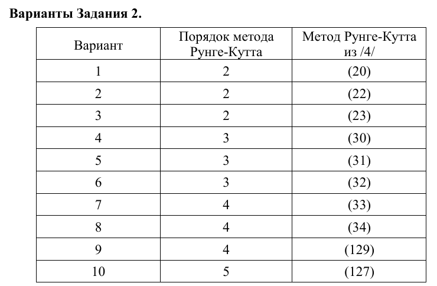
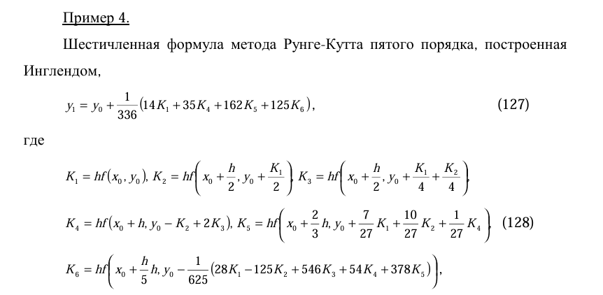

# Задача

Тема 6 Задание 2 Вариант 10

Задание 2. Решение линейной краевой задачи для дифференциального уравнения второго порядка методом универсальной дифференциальной прогонки.

Порядок метоа: 5
Формула:

